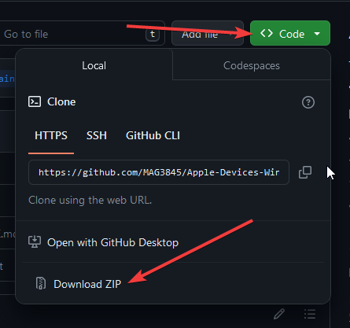

# Orginal 

Please check the original Repo : [REPO](https://github.com/JimDude7404/Apple-Devices-Windows-10)

I have rewrite it to correct it with my absolute not knowledge of Powershell (Google my best friends)

So now, it's work with every version of Apple Devices !

# Requirement

- Some Basic Knowledge about CLI
- Have activate Developers option in Windows 

# How that work ?

## 1 - Clone the repo

Clone the repo with your favorite browser or with Git

```shell
git clone https://github.com/MAG3845/Apple-Devices-Windows-10-Fix.git
```


## 2 - Unzip

Use your favorite unzipper, for me it's 7-Zip

## 3 - Download the last Appx

Go on [https://store.rg-adguard.net/](https://store.rg-adguard.net/)

Select "ProductID" and enter : "9NP83LWLPZ9K"

Download the last file with .msixbundle at this end


## 4 - Unzip and Past Apple Devices

First, unzip our .MSIXBundle, use your favorite unzipper !


After that, you will need to go where your unzipper, unzip our .MSIXBundle and unzip .msix !


## 5 - Copy and Past all content on our Folder

So now, Copy all **content** (not the folder, the content in it) of our new Folder, and past it in "AppleDevices" folder of our Repos !


## 6 - Run the script ! And use Apple Devices

Run a Powershell with Admin Right !

Go on our folder with ```cd```

Run it with ```.\setup.ps1```

# Informations

I'm not a expert of Powershell, so my code is very unclean, and I knew it. 
So you can make Pull Request, if you want you can PM on Discord : .mag. or by mail : contact@magcloud.eu
Btw I'm to receive some tips about Powershell even if I prefer Bash !

I decline all responsabilites of what my script do on your devices